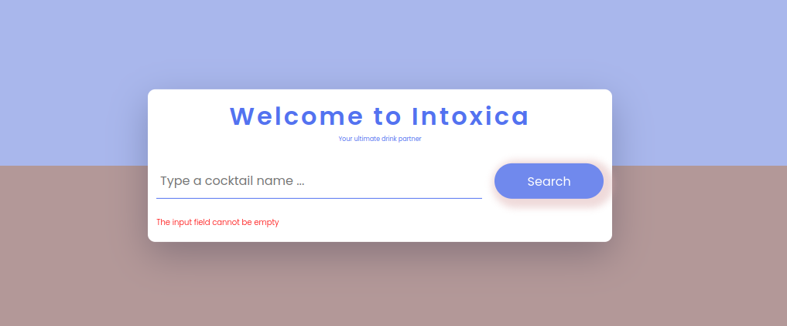

# Author

> > > > > > > Geoffrey Kithuku

Welcome to Intoxica. You wanna get intoxicated? This is the right app for you. Prepare any kind of cocktail at your comfort.

# Intoxica

  

# Prerequisites

Have Git installed.

Have a text editor installed e.g VS Code, Atom

# Technologies Used

HTML, CSS, cocktailDb API and JavaScript

Any text editor of your choice.

# Setup/Installation Requirements

Open your terminal (ctrl+alt+T).

Initialize git on your terminal.

git clone git@github.com:geoffreykithuku/intoxica.git.

open the 'intoxica' folder.

Open the file named index.html on your preferred browser.

Enter cocktail of choice into the input boxes.

You use any known word or ingredient

Click Submit.

Wait for the response from the web application to get your cocktail info, steps and preparation procedure.

# Events

Load, submit, click

# API used

https://thecocktaildb.com

# License

<<<<<<< HEAD

=======

> > > > > > > eabd9ab91bacbd6b49cc2dea9e8cef15aee5c8d1
> > > > > > > this project is copyright free. feel free to fork, clone and edit
